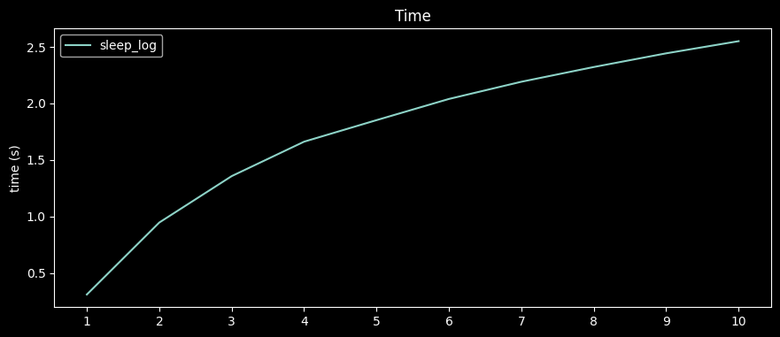

# BenchmarKit
* TO BE COMPLETED !

`benchmarkit` is a simple library that allows the monitoring of the time and memory cost of functions.


```python
import time
from benchmarkit import BenchmarKit

def f(d):
   _ = 'c' * 10 **d
    
execution_time, memory_peak = BenchmarKit.run(func=f, args=(10,), precision=2)

print(f"function '{f.__name__}' took {execution_time} seconds and used up to {memory_peak} megabytes in memory")
```

outputs :

```
function f took 3.26 seconds and used up to 939.36 megabytes in memory
```


```python
from benchmarkit import BenchmarKit


result = BenchmarKit.benchmark(
    funcs=[f],
    args=[(1,),(5,),(10,) ],
    labels=['1', '5', '10']
)
```

```python
result.table()
```

outputs 

```
                  time       memory
function run                       
f        1    0.296611    55.273438
         2    0.274666    55.171875
         3    0.263487    54.398438
         4    0.252139    54.843750
         5    0.268910    56.082031
         6    0.270917    56.562500
         7    0.256834    64.519531
         8    0.290258   150.062500
         9    0.581589   670.613281
         10   3.157614  1171.406250
```

```
result.plot()
```

outputs :


Why not style it ? 😎

```
result.plot(theme="dark_background")
```


```python
import time, math
from benchmarkit import BenchmarKit

def sleep_log(d):
    time.sleep(math.log(d))
    
result = BenchmarKit.benchmark(
    funcs=[sleep_log],
    args=[(x,) for x in range(1, 11)],
    labels=[str(x) for x in range(1, 11)],
)

result.plot(theme="dark_background", figures=["time"], figsize=(10, 5))
```
outputs : 



```python
import time, math, numpy
from benchmarkit import BenchmarKit


def sleep_log(d):
    time.sleep(math.log(d))

def sleep_log2(d):
    time.sleep(math.log2(d))

def sleep_linear(d):
    time.sleep(d) 


test_cases =  numpy.arange(1, 5, 0.25)

result = BenchmarKit.benchmark(
    funcs=[sleep_log, sleep_log2, sleep_linear],
    args=[(x,) for x in test_cases],
    labels=[str(x) for x in test_cases],
)

result.plot(figures=["time"], figsize=(10, 10))
```

outputs:


