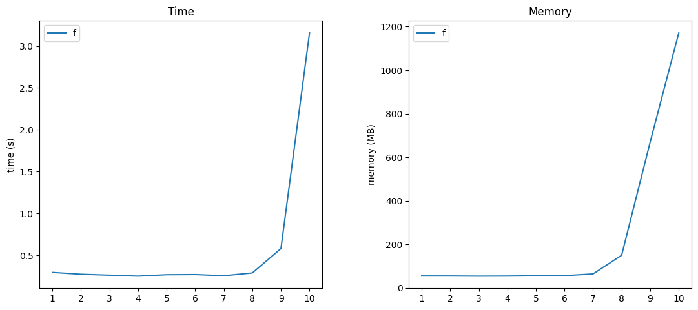
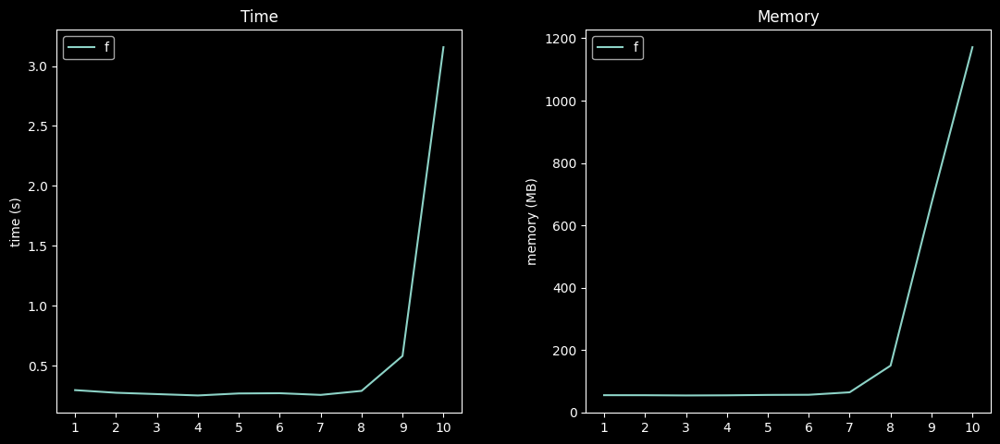
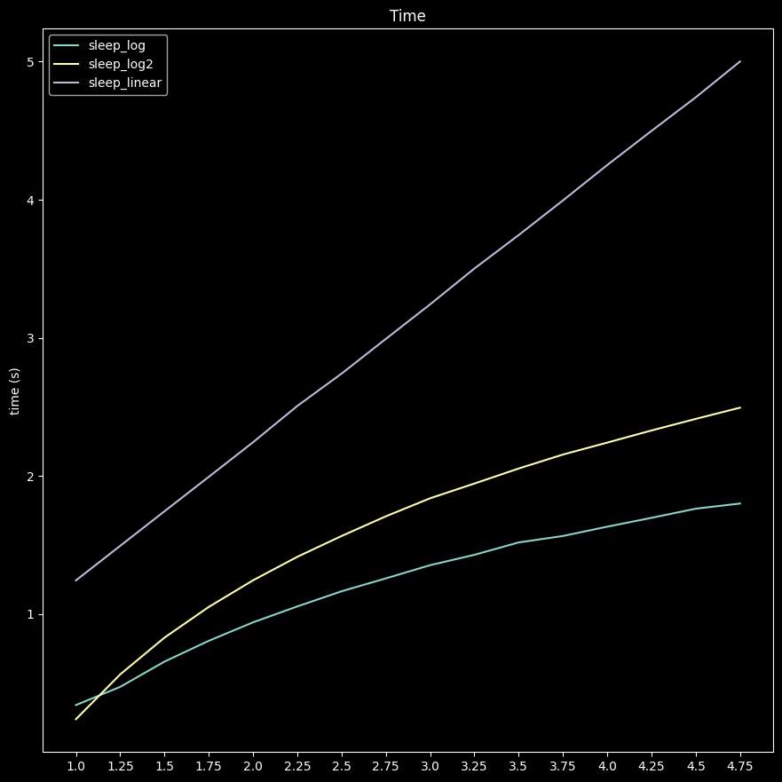

# BenchmarKit

benchmarkit is a simple library that allows the monitoring of the time and memory cost of functions.

## Usage

### Benchmark single callable

`BenchmarKit.run` allows to run a callable with a list of arguments in a separate process and monitors the execution time and memory allocation.

```python
def run(
    func: Callable,
    args: Tuple=(),
    kwargs: Dict={},
    proxy: BaseProxy = None,
    res_label: str = None,
    precision: int = None,
) -> Tuple[float, float]:
```

#### Parameters

* ***func : Callable,*** <br/>&nbsp; callable object to profile.
* ***args : Tuple, optional, default = ()*** <br/>&nbsp; list of callable arguments.
* ***kwargs: Dict, optional, default = {}*** <br/>&nbsp; list of callable keywork arguments.
* ***proxy: BaseProxy, optional*** <br/>&nbsp; multiprocess proxy to store profiling results.
* ***res_label: str, optional, defaults to callable name*** <br/>&nbsp; label to use to identify the callable profiling results.
* ***precision: int, optional*** <br/>&nbsp; round precision of profiling results. defaults to no rounding.


#### Example

```python
import time
from benchmarkit import BenchmarKit

def f(d):
   _ = 'c' * 10 **d
    
execution_time, memory_peak = BenchmarKit.run(func=f, args=(10,), precision=2)

print(f"function '{f.__name__}' took {execution_time} seconds and used up to {memory_peak} megabytes in memory")
```

```
function f took 3.26 seconds and used up to 939.36 megabytes in memory
```

### Benchmark single callable over multiple arguments

`BenchmarKit.benchmark` offers a way to benchmark a single or multiple callables over differents inputs. This is very useful for profiling how the callable behave with different sets (or size) of inputs.

```python
def benchmark(
        funcs: List[Callable],
        args: List[Tuple],
        labels: List[str]=[],
        precision: int = None,
    ) -> BenchmarkResults:
```

#### Parameters
* ***funcs : List[Callable],*** <br/>&nbsp; list of callables to profile.
* ***args : List[Tuple],*** <br/>&nbsp; list of callable arguments to use when profiling.
* ***labels : List[str], optional*** <br/>&nbsp; list of custom labels to identify executions. defaults to ['run_1', 'run_2' ...]
* ***precision: int, optional*** <br/>&nbsp; round precision of profiling results. defaults to no rounding.

#### Returns
* ***out:***<br/>&nbsp; BenchmarkResults


#### Example

```python
from benchmarkit import BenchmarKit


result = BenchmarKit.benchmark(
    funcs=[f],
    args=[(1,),(5,),(10,) ],
    labels=['1', '5', '10']
)
```

Results can be fetched in differents forms using `table()`, `dict()` and `plot()`


```
>>> result.table()

                  time       memory
function run                       
f        1    0.296611    55.273438
         2    0.274666    55.171875
         3    0.263487    54.398438
         4    0.252139    54.843750
         5    0.268910    56.082031
         6    0.270917    56.562500
         7    0.256834    64.519531
         8    0.290258   150.062500
         9    0.581589   670.613281
         10   3.157614  1171.406250
```

```
>>> result.plot()
```




Why not style it ? 😎. `benchmarkit` supports `matplotlib` [themes](https://matplotlib.org/stable/gallery/style_sheets/style_sheets_reference.html). 

```
result.plot(theme="dark_background")
```




Here is a simple example with multiple functions:
```python
import time, math, numpy
from benchmarkit import BenchmarKit


def sleep_log(d):
    time.sleep(math.log(d))

def sleep_log2(d):
    time.sleep(math.log2(d))

def sleep_linear(d):
    time.sleep(d) 


test_cases =  numpy.arange(1, 5, 0.25)

result = BenchmarKit.benchmark(
    funcs=[sleep_log, sleep_log2, sleep_linear],
    args=[(x,) for x in test_cases],
    labels=[str(x) for x in test_cases],
)

result.plot(figures=["time"], figsize=(10, 10))
```


